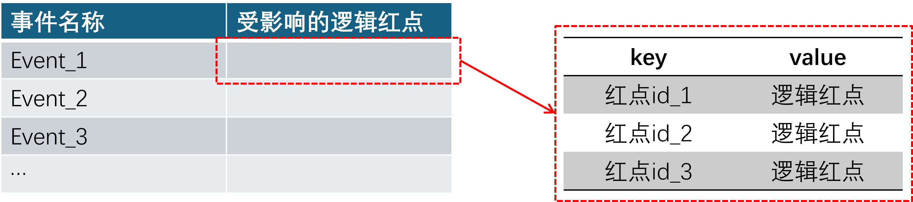
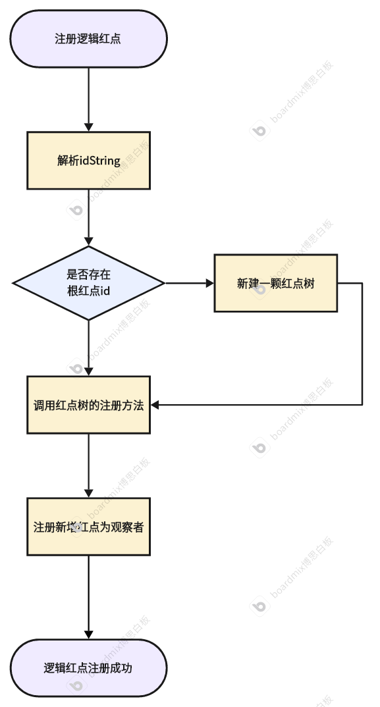
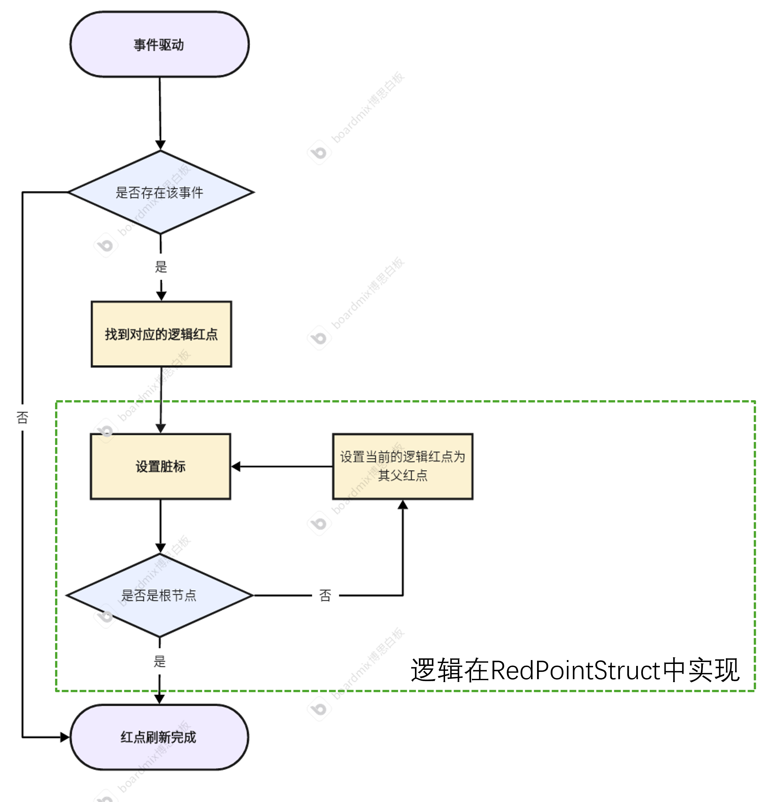
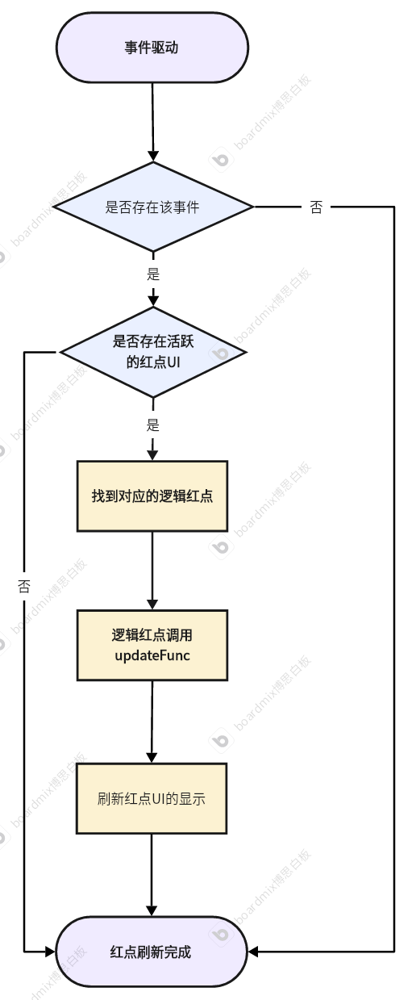
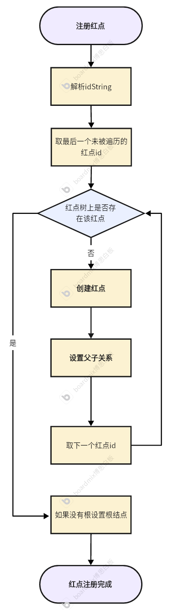
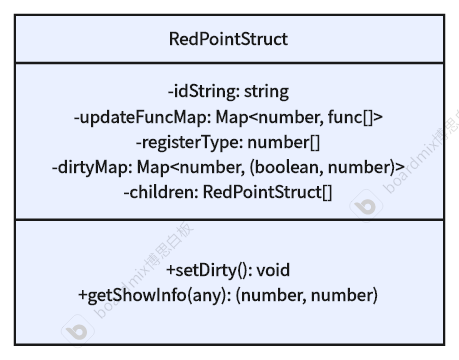

# 红点系统概述

## 红点系统的结构

红点主要分为以下两种结构：

**树型红点**

这是最常见的红点系统的机构，子红点的显示状态由其自身决定，父红点的显示状态受子红点和自身共同决定。

**独立红点**

这类红点主要用于一些不穿透的独立红点，它们的显示不会影响上一级界面。


## 红点的显示类型

**new红点**

一般用于新功能开启或者获得新道具时，消失方式为点击后消失，客户端存储点击状态。

**普通红点**

最常见的红点，一般用于玩法可玩、道具可用或其他策划希望玩家点击的功能，点击不会消失，需要满足一定条件（如没有使用次数等）后消失，更新方式一般是玩家操作后的服务器消息回调。

**数字红点**

一般用于玩法次数有限，提示玩家需要消耗，每次使用后数字红点会减少1，剩余次数为0红点消失。

**自定义红点**

为一些玩法特设的红点，逻辑可能和以上任意一种相同，但是表现不同。比如，策划可以要求有新的道具到包使用绿色感叹号，或者有新任务使用黄色感叹号（逻辑同普通红点）。

## 红点系统设计目标

我们的红点系统旨在提供 **高度易用性**，在预先构建好逻辑红点树的前提下，业务开发人员仅需绑定/解绑红点UI，整个红点系统就会自动对红点的数据和显示进行管理；具备 **强大可拓展性**，采用树状结构支持父节点自动汇总、叶子节点可绑定多标签(Tag)，且支持运行时动态增减，样式可定制，适应复杂场景；同时，系统实现MVC设计，红点状态由事件/驱动计算（如任务完成、新消息到达），并被同一管理，UI 仅监听状态变更负责渲染，不涉业务逻辑，确保模块内聚、接口清晰，逻辑可测试、代码维护性高。


# 红点系统设计

在叙述以下系统设计前，先明确以下几个概念：

**逻辑红点：**§红点的实际数据对象，红点的显示状态由逻辑红点进行计算。

**红点UI：**红点的表现层，显示状态通过红点系统查询逻辑红点的状态进行更新。

**红点id：**红点的唯一key，可以唯一索引到逻辑红点。

**红点条件：**判断红点是否显示的逻辑。一个逻辑红点可以包含多个红点条件，条件之间是【或】关系，每个红点条件对应唯一的刷新方法。


## 1. `RedPointManager`

整个红点系统由`RedPointManager`统一管理，提供对外接口来管理红点。`RedPointManager`主要包含三部分：红点森林、红点`UI`的`Map`和事件观察者（`eventObserver`）。这样设计的主要目的，是可以把逻辑、`UI`和事件相互隔离，避免耦合。

### 红点森林

因为在开发过程中，可能会遇到策划需要红点不进行穿透（自定义红点穿透），这种情况下，子红点的显示就不应该影响父红点的显示。红点森林包含多棵红点树，每棵红点树作为一个独立的结构进行逻辑管理。红点森林保存所有红点树的根节点。

### 事件观察者



事件观察者`eventObserverMap`保存了每一个不同的事件会影响的红点。当其中的事件发生时，`RedPointManager`会检索是否有相关的**逻辑红点**需要刷新。不同事件可能会对应同一个逻辑红点，因为红点的刷新可能会由多个事件驱动。

### 红点UI映射

保存红点UI的映射，当事件发生时，检查`redPointUIMap`判断是否有在界面的红点需要刷新，当存在这样的红点时，会通过`RedPointManager`找到相关联的逻辑红点进行显示刷新，这个过程会实际进行红点刷新方法（`updateFunc`）的调用，重置脏标。

### 逻辑红点的注册与刷新

**必须参数**

`idString`：红点的层级路径所对应的字符串

**注册流程图**



**刷新流程图**



1. 事件通知`RedPointManager`，`RedPointManager`找到相应的事件观察者
2. 向根节点设置脏标，逻辑上，但不进行逻辑判断
3. 如果该红点`UI`注册在`RedPointManager`中，则调用对应红点的刷新方法（向叶子红点递归地计算红点），刷新红点的显示，重置脏标

### 业务层绑定

客户端在进行业务开发时，

进入界面（如`onLoad`）时，将红点UI和红点id进行绑定。当事件到来时，通过`redPointUIMap`进行红点UI的刷新。

退出界面（如`onUnload`）时，需要将红点UI从`redPointUIMap`中清除，防止不必要的刷新逻辑，同时避免当红点UI销毁了调用刷新方法的报错。

**UI刷新流程**



### 非叶子结点刷新的处理方法

1. 若有自己的刷新方法，调用刷新方法数，返回为`true`则不再对子红点进行遍历，脏标设置为false：
   情况①：子红点又因为事件发生了变化，则该红点仍然会被设置脏标；
   情况②：该红点因为事件改变，本身需要设置脏标；
   优先级不会产生问题，因为是通过红点map进行管理的，所以不同类型的红点会有独立的脏标

2. 否则，递归地调用子红点的刷新方法。

   

## 2. `RedPointTree`

### 简介


上图为以字典树实现的红点树的逻辑层级结构，通过红点的路径（如`MAIN|BAG|ITEM_1`）可以快速索引到具体的`RedPointStruct`。由于每一个红点`id`是唯一的，因此红点路径（`idString`）也是唯一的。同时又可以通过`id`快速检索到具体对应的是哪个功能，为业务开发提供了较大的可扩展性。

### 构造红点树

构造红点树的流程相当于在红点树上新增子红点。一般来说应该从根开始建立，因为在红点树中保存了红点`id`到`RedPointStruct`的映射，所以可以从**叶子到根**进行构造。这样做的好处在于，1.可以避免遍历从根向下进行遍历（尽管事件复杂度为`log(n)`）；2.可以把直接添加红点到父红点和建树逻辑统一。整个流程相当于递归地构造一棵子树。

从叶子到根流程如下：



1.通过 `idString`（如 `"main|task|daily"`）从 **叶子到根** 依次构造节点；

2.如果某一层节点已存在，则说明已经构建完；

3.自动建立父子关系；

4..如果尚未设置 `root`，则以最顶层 id 对应节点作为根节点。

```pseudocode
function register(params):
    idPath = params.idString              # e.g., "main|task|daily"
    idList = split(idPath, "|")           # ["main", "task", "daily"]
    childNode = null                      # 上一个构建的节点（初始为 null）

    # 从叶子节点开始向上构建
    for i from end of idList to start:
        id = idList[i]
        
        if redPointNodeMap contains id:
            # 节点已存在，不需要继续向上构建
            break
            
        newNode = createRedPointNode(id, idPath)

        if childNode is not null:
            newNode.addChild(childNode)
            childNode.setParent(newNode)

        redPointNodeMap[id] = newNode
        childNode = newNode               # 本轮构造的节点将作为下一轮的 child

    # 设置根节点（如果还没有）
    if root is null:
        root = redPointNodeMap[ idList[0] ]

    # 叶子节点设置更新方法
    leafId = idList[-1]                   # 最后一个 ID
    redPointNodeMap[leafId].setUpdateFunc(params.updateFunc)

```


红点树向`RedPointManager`提供接口来注册和删除红点，同时保存红点`id`到`RedPointStruct`的映射


## 3. `RedPointStruct`



上图描述了`RedPointStruct`的基本结构和方法，下面将详细描述一些重要的数据和方法。

### 构造方法

**必要参数**

在`ctor`方法中，`id`和`idString`是构造`RedPointStruct`的必要参数。`idString`是在注册红点树时传入的，在构造红点树的过程中会解析`idString`生成`id`。

**可选参数**

`updateFuncMap`（`key`为`RedPointType`，`value`为`funcList`）是可选参数。在实现中并未强制要求叶子红点有刷新方法，但在业务开发中，必须设置刷新方法，否则这个红点就没有意义了，所以叶子红点这个参数是必需的。对于非叶子红点，这个参数才是可选的。

### 内部数据

**`dirtyMap`**

`dirtyMap`保存了`RedPointStruct`的脏标和红点状态的缓存值。设置脏标的主要目的是减少不必要的计算。因为红点树作为保存红点的数据结构，在游戏开始时就创建出来了，但是实际要求显示的红点可能并不存在，所以计算红点的显示数据会浪费不必要的性能。使用`dirtyMap`后，在事件触发时对影响到的红点设置脏标，在需要实际计算时，只有有脏标的才进行计算，大大减少了不必要的计算。

**`children`&`parent`**

顾名思义，保存当前红点的子红点（`list`）和父红点，实现父子之间的双向链接。


每一个红点是否都需要有刷新方法？

叶子红点必须有刷新方法，否则没有意义。非叶红点可以没有刷新方法（通过子红点来进行刷新）。当非叶红点有刷新方法时，需要确定刷新方法的优先级。

## 4. 红点UI

红点UI通过组件化的形式进行实现，这样的实现方式有如下优点：

1. 易于添加，拓展
2. 在红点进入界面（如红点node的onLoad时机）时可以自己进行管理红点的刷新，不需要业务开发者手动进行调用
3. 对外提供接口，从而业务开发者也可以自己管理红点的显示属性

**构造参数**

`红点id`：红点的唯一key
`redPointType`：红点当前的显示类型。因为这里是界面上的信息，所以当前的显示类型应当唯一，如果有多个显示类型应当能确定优先级

`customData(optional)`：用户自定义数据。为了解决多个红点共用一个红点id的可能性，所以需要传入customData（比如背包道具的typeid），以便可以自动处理红点刷新逻辑。但是需要明确的是，自定义数据只是为了将相同id的红点进一步细分出来，具体的逻辑数据应当在updateFunc中处理，并不是把数据保存在node上。


## 5. 红点问题检查工具

TODO


## 6. 红点树结构配置方案

### 方案一、从配置表构建

策划使用配置表，通过一定的结构实现红点树的树型结构，客户端在进入游戏前，预先生成红点树的数据结构。

优点：主要由策划进行维护

缺点：可视化效果差，有需求变更时需要策划客户端两方共同解决

### 方案二、通过Unity GUI实现

通过`UGUI`开发一个插件，实现一个可视化的红点树构造工具，具体功能如下：

1. 可以添加根结点，并在根节点上递归地添加子结点
2. 可以通过`Json`文件生成红点树
3. 可以将红点树导出为`Json`文件
4. 添加子红点时，可以提供构造函数必要的参数
5. 修改父红点的名称时，需要同步修改子红点的名称

优点：可视化效果好，完全由客户端维护

缺点：需要额外开发插件

# 需要明确的需求

父红点的显示类型的决定因素：

1. 唯一确定的（比如，即使子红点是数字红点，但父红点仍然显示为红点）
2. 由子红点决定（这种情况下子红点和父红点的显示类型应当一致）
3. 由显示优先级决定（可拓展性高，多个点亮的子红点可以根据显示优先级影响父红点的显示）

父红点是否需要红点条件：应该是需要的，需要思考一种管理方式

红点结构的生成方式：

1. 预先配置生成。策划预先定义好红点结构，客户端注册逻辑红点结构.
2. 客户端在代码编写过程中自行注册，需要妥善管理好树型结构（注册到树中、注册到父红点）
   直接注册到父红点中需要判断父红点是否存在（通过红点唯一Id判断）

# 性能优化

1. 延迟刷新

当事件触发时，只有红点`UI`有效的红点才进行逻辑刷新，否则只设置脏标。是否可以在游戏空闲帧进行一次统一刷新？

2. 红点整合

有些红点其实刷新逻辑和显示逻辑是相同的（比如有不同的可完成任务，策划希望用不同的红点来表示，但内部逻辑都是一样的），只是显示的`UI`有差异，可以归为一类

3. 如果一个非叶结点的子红点全都没了，且没有刷新方法，这个红点就没有意义了，应该从红点树中取消注册
4. 如果一个分类下有很多性质类似的子红点，比如背包，如何减少红点树占用的内存呢？现在让父结点有刷新方法或许可以解决。

# 仍留疑问

1. 某个非叶子结点变化了如何刷新（UI有效）？
   如果该结点的`showNum>0`则不对子红点进行遍历（脏标仍然为`false`），否则需要遍历，
2. 如果有需求是希望红点用特别的符号代表，比如说聊天红点希望用最新一条记录的头像这种怎么处理？
   新增的自定义红点，`ctor`时需要传入方法，单独处理？
3. 红点的树构建时，如何设置刷新方法（`RedPointStruct`），如何关联到相应的刷新方法？
   通过红点id映射到刷新方法，但是需要考虑如果有多个刷新方法时如何实现。

4. 红点的刷新方法如何绑定到红点上？
   新增一个红点刷新方法配置文件（刷新方法的key关联到刷新方法），在红点构造时传入相应的key来映射到对应方法。
   就是上述所说的红点条件唯一对应刷新方法。

5. 红点UI是否应当与红点Id唯一对应？

   考虑到有多个UI使用一个红点Id的逻辑，比如背包道具，不同的道具可能使用的是同一个逻辑红点，只是传入的数据不同，但是这样的脏标设置就会有问题。
   方案1：每一个红点都采用不同的红点id

   优点：方便处理脏标	缺点：会导致大量的内存占用，并且拓展不方便

   方案2：刷新逻辑相同的红点采用相同的刷新方法

   优点：解决内存占用问题	缺点：脏标设置会冲突

   现在暂时采用idString作为key，但是这样我认为会有很多冗余，后续考虑是否可以优化脏标设置方法。或者可以用map保存ui映射，这样可以同一个id一次性对应，但这样否认了之前的唯一对应关系

